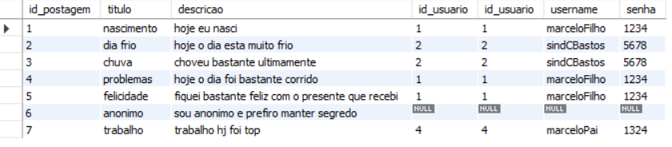
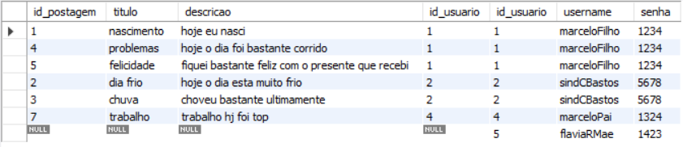

# Aprendendo SQL
#### *com MySQL*
Repositório inspirado nas aulas ["MySQL Full Course for free 🐬 (2023)"](https://www.youtube.com/watch?v=5OdVJbNCSso) e ["MySQL Node.js Express"](https://www.youtube.com/watch?v=Hej48pi_lOc) disponiveis gratuitamente no YouTube.
## Criando Banco de Dados
            
```sql
CREATE DATABASE nomeDB;
```
Cria o banco de dados de nome 'nomeDB'.
            
```sql
DROP DATABASE nomeDB;
```
Exclui o banco de dados.
            
```sql
USE nomeDB;
```
Define o banco de dados 'nomeDB' como o banco de dados padrão.
            
## Tabelas
            
```sql
CREATE TABLE nomeTabela;
```
Cria uma tabela chamada 'nomeTabela'.
            
```sql
SELECT * FROM nomeTabela;
```
Mostra a tabela inteira.
            
```sql
RENAME TABLE nomeTabela TO novoNomeTabela;
```
Renomeia a tabela de 'nomeTabela' para 'novoNomeTabela'.
            
```sql
DROP TABLE novoNomeTabela;
```
Exclui a tabela 'novoNomeTabela'.
            
## Tipos de Dados em Tabelas
            
- `INT`
  - Número Inteiro
- `VARCHAR(x)`
  - Conjunto de caracteres
  - `x` = Número máximo de caracteres 
- `DECIMAL(x, y)`
  - Número Real
  - `x` = Número máximo de caracteres
  - `y` = Número de caracteres depois da vírgula
- `DATE`
  - Data
- `DATETIME`
  - Data e Hora
            
## Colunas
            
```sql
ALTER TABLE nomeTabela
ADD coluna VARCHAR(30);
```
Cria uma nova coluna de nome 'coluna'.
            
```sql
ALTER TABLE nomeTabela
RENAME COLUMN coluna TO colunaNova;
```
Renomeia a coluna de 'coluna' para 'colunaNova'.
            
```sql
ALTER TABLE nomeTabela
MODIFY COLUMN colunaNova INT;
```
Muda o tipo de dado da coluna 'colunaNova' para `INT`.
            
```sql
ALTER TABLE nomeTabela
MODIFY COLUMN colunaNova INT
FIRST;
```
Move a coluna 'colunaNova' para a primeira posição na tabela.
            
```sql
ALTER TABLE nomeTabela
MODIFY COLUMN colunaNova INT
AFTER outraColuna;
```
Move a coluna 'colunaNova' para depois da coluna 'outraColuna'.
            
```sql
ALTER TABLE nomeTabela
DROP COLUMN colunaNova;
```
Exclui a coluna 'colunaNova'.
            
## Inserir Informações
            
```sql
INSERT INTO tabela
VALUES (x, y);
```
Insere os valores na tabela.
- `x` = valor da primeira coluna
- `y` = valor da segunda coluna

```sql
INSERT INTO tabela (coluna1, coluna2)
VALUES(valor1, valor2);
```
Insere apenas os valores das colunas selcionadas entre parenteses, mantendo as outras colunas como valor `null`

## Consultas Personalizadas
```sql
  SELECT coluna1, coluna2 FROM tabela;
```
Mostra apenas a 'coluna1' e 'coluna2' da tabela

```sql
SELECT * FROM tabela
WHERE coluna1 = 'valor1';
```
Mostra apenas as colunas em que a 'coluna1' é igual ao 'valor1'

```sql
SELECT * FROM tabela
WHERE coluna1 > '1';
```
Mostra apenas as colunas em que a 'coluna1' é maior que 1

```sql
SELECT * FROM tabela
WHERE coluna1 IS NOT NULL;
```
Mostra apenas as colunas em que a 'coluna1' não é `null`

## Editar e Excluir 

### Editar

```sql
UPDATE tabela
SET coluna1 = 10
WHERE coluna_id = 1;
```
Adiciona a 'coluna1' o valor 10 nas colunas de id 1

```sql
UPDATE tabela
SET coluna1 = 10,
    coluna2 = 'String'
WHERE coluna_id = 1;
```
Com uma vírgula se pode adicionar mais de um valor em colunas diferentes

### Excluir

```sql
DELETE FROM tabela;
```
Exclui todos os valores das colunas na tabela

```sql
DELETE FROM tabela
WHERE coluna_id = 1;
```
Exclui os valores das colunas de id 1

## Commit e Rollback

### Commit 
```sql
SET AUTOCOMIT = OFF;
```
Deixa desabilitada a função de salvar a transação automaticamente, fazendo com que precise salvar manualmente

```sql
COMMIT;
```
Cria um 'Savepoint'

```sql
ROLLBACK;
```
Volta no ultimo 'Savepoint' criado

## `CURRENT_DATE()` x `CURRENT_TIME()` x `NOW()`
- `CURRENT_DATE()` possui o tipo `DATE` e mostra a Data atual
- `CURRENT_TIME()` possui o tipo `TIME` e mostra a Hora atual
- `NOW()` possui o tipo `DATETIME` e mostra a Data e a Hora atual

## UNIQUE

```sql
CREATE TABLE usuarios (
  id_usuario INT,
  username VARCHAR(30) UNIQUE
);
```
Usando `UNIQUE` não poderá haver outro 'username' igual a outro ja inserido
```sql
ALTER TABLE usuarios 
ADD CONSTRAINT
UNIQUE(username);
```
Caso a tabela ja tenha sido criada, seria inserido desse modo a restrição `UNIQUE`

## NOT NULL

```sql
CREATE TABLE usuarios (
  id_usuario INT,
  username VARCHAR(30),
  senha VARCHAR(20) NOT NULL
);
```
Usando `NOT NULL` o valor não poderá ser = `null`
```sql
ALTER TABLE usuarios 
MODIFY senha VARCHAR(20) NOT NULL;
```
Caso a tabela ja tenha sido criada, seria inserido desse modo a restrição `NOT NULL`

## CHECK

```sql
CREATE TABLE usuarios (
  id_usuario INT,
  username VARCHAR(30),
  senha VARCHAR(20),
  idade INT,
  CONSTRAINT checar_idade CHECK(idade >= 18)
);
```
Usando `CHECK` a idade não poderá ser menor ou igual a 18
```sql
ALTER TABLE usuarios 
ADD CONSTRAINT checar_idade CHECK(idade >= 18);
```
Caso a tabela ja tenha sido criada, seria inserido desse modo a restrição `CHECK`
```sql
ALTER TABLE usuarios 
DROP CHECK checar_idade;
```
Deletando o `CHECK` 

## DEFAULT
```sql
CREATE TABLE usuarios (
  id_usuario INT,
  username VARCHAR(30),
  senha VARCHAR(20),
  idade INT,
  salario DECIMAL(6, 2) DEFAULT 0
);
```
Usando `DEFAULT`, caso ao inserir os valores, nenhum 'salario' tenha sido inserido, ele será dado como `0`, e não `null`
```sql
ALTER TABLE usuarios 
ALTER salario SET DEFAULT 0;
```
Caso a tabela ja tenha sido criada, seria inserido desse modo a restrição `DEFAULT`
## PRIMARY KEY
```sql
CREATE TABLE usuarios (
  id_usuario INT PRIMARY KEY,
  username VARCHAR(30),
  senha VARCHAR(20),
);
```
Usando `PRIMARY KEY`, a coluna terá a propriedade `UNIQUE` e `NOT NULL`, podendo apenas haver uma PRIMARY KEY por tabela.
```sql
ALTER TABLE usuarios 
ADD CONSTRAINT 
PRIMARY KEY(id);
```
Caso a tabela ja tenha sido criada, seria inserido desse modo a restrição `PRIMARY KEY`

## AUTO_INCREMENT
```sql
CREATE TABLE usuarios (
  id_usuario INT PRIMARY KEY AUTO_INCREMENT,
  username VARCHAR(30),
  senha VARCHAR(20),
);
```
```sql
INSERT INTO usuarios(username, password)
VALUES('johnDoe', '1234abcd');
```
Adiciona automáticamente um numero a mais em cada 'id, sem precisar que o 'id' seja manualmente inserido
```sql
ALTER TABLE usuarios 
AUTO_INCREMENT = 1000;
```
O `AUTO_INCREMENT` por default começa no número 1, editando assim fará com que ele comece a partir do número 1000 ou qualquer número de seu desejo

## FOREIGN KEYS
Criarão um Link entre tabelas diferente através de suas `PRIMARY KEY`'s
```sql
CREATE TABLE usuarios (
  id_usuario INT PRIMARY KEY AUTO_INCREMENT,
  username VARCHAR(30),
  senha VARCHAR(20)
);
```

```sql
CREATE TABLE postagens (
  id_postagem INT PRIMARY KEY AUTO_INCREMENT,
  titulo VARCHAR(100),
  descricao VARCHAR(300),
  id_usuario INT,
  FOREIGN KEY(id_usuario) REFERENCES usuarios(id_usuario)
);
```
Usando `FOREIGN KEY` a tabela de 'postagens' cria um link entre com a tabela de 'usuarios' <br>

Caso voce queira deletar um usuario que esteja atribuido como uma `FOREIGN KEY` a outra tabela

```sql
DELETE FROM usuarios
WHERE id_usuario = 1;
```
Será retornado esse erro:<br>
___Error Code: 1451. Cannot delete or update a parent row: a foreign key constraint fails ('aprendendo_sql'.'postagens', CONSTRAINT 'postagens_ibfk_1' FOREIGN KEY ('id_usuario') REFERENCES 'usuarios' ('id_usuario'))-___ <br>
Demonstrando que não se pode deletar uma coluna em que sua `PRIMARY KEY` esta sendo usando como `FOREIGN KEY` em outra tabela

# JOINS

## INNER JOIN

```sql
SELECT *
FROM postagens INNER JOIN usuarios
ON postagens.id_usuario = usuarios.id_usuario;
```


## LEFT JOIN

```sql
SELECT *
FROM postagens LEFT JOIN usuarios
ON postagens.id_usuario = usuarios.id_usuario;
```



## RIGHT JOIN

```sql
SELECT *
FROM postagens RIGHT JOIN usuarios
ON postagens.id_usuario = usuarios.id_usuario;
```


## Mostrar colunas específicas
```sql
SELECT id_postagem, titulo, descricao, username
FROM postagens INNER JOIN usuarios
ON postagens.id_usuario = usuarios.id_usuario;
```
Irá mostrar apenas as colunas especificadas após o `SELECT`


